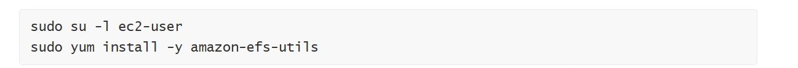

<h1>📦 AWS EFS + EC2 Setup Project</h1>

This project demonstrates how to **manually create and configure** an Amazon Elastic File System (EFS) and mount it on an Amazon EC2 instance running Amazon Linux 2023.
 ✅ Ideal for learning cloud storage, NFS-based mounting, and real-world AWS infrastructure basics.

  +-------------------+
            |   EC2 Instance    |
            | Amazon Linux 2023 |
            +--------+----------+
                     |
                Mounts via NFS
                     |
             +-------v--------+
             |     Amazon     |
             |     EFS        |
             +----------------+

<h3>🛠️ Services Used</h3>

- **Amazon EC2** – Virtual server to run a Linux instance
- **Amazon EFS** – Scalable NFS storage
- **Amazon VPC** – Networking layer
- **Amazon CloudWatch** *(optional)* – Monitor EFS metrics

<h3>📋 Project Goals</h3>

1. ✅ Create a custom **security group** to allow SSH and NFS traffic
2. ✅ Launch an EC2 instance (Amazon Linux 2023)
3. ✅ Create an EFS file system with a mount target
4. ✅ Install `amazon-efs-utils` and mount EFS to EC2
5. ✅ Test the connection and validate file sharing
6. ✅ (Optional) Monitor EFS using CloudWatch

---

<h3>🚀 Setup Instructions</h3>

### 1️⃣ Create a Security Group

Allow:
- SSH (port 22) from your IP
- NFS (port 2049) from VPC CIDR (e.g. `10.0.0.0/16`)

### 2️⃣ Launch EC2 Instance

- AMI: **Amazon Linux 2023**
- Type: `t3.micro`
- Attach the security group created above
- Public Subnet with public IP enabled

### 3️⃣ Create an EFS File System

- Choose same **VPC** as EC2
- Add **mount target** in the same subnet as EC2
- Use the same **security group** for access

### 4️⃣ Connect to EC2 Instance

Using Session Manager or SSH:

``bash
ssh -i your-key.pem ec2-user@<public-ip>
'''

In your EC2 terminal session, run the following command to install the required utilities:
 

 

- Run the following command to create directory for mount: sudo mkdir efs.
- At the top of the AWS Management Console, in the search box, search for and choose EFS.
- Choose My First EFS File System.
- In the Amazon EFS Console, on the top right corner of the page, choose Attach to open the Amazon EC2 mount instructions.
- In your EC2 terminal session, Copy and run the entire command in the Using the NFS client section.

The mount command should look similar to this example:

sudo mount -t nfs4 -o nfsvers=4.1,rsize=1048576,wsize=1048576,hard,timeo=600,retrans=2,noresvport fs-bce57914.efs.us-west-2.amazonaws.com:/ efs

 The provided sudo mount... command uses the default Linux mount options.

 Get a full summary of the available and used disk space usage by entering: sudo df -hT
This following screenshot is an example of the output from the following disk filesystem command: 
  

 

